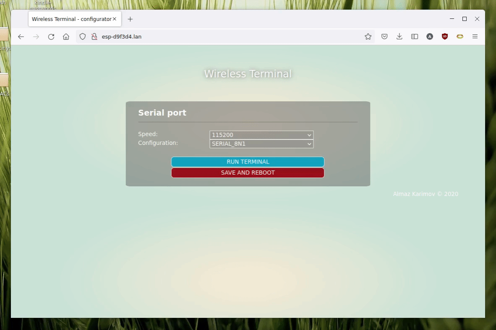

## Wireless Terminal - simple, configurable, self hosted, ESP8266 based WIFI-to-UART bridge


Assume you have a serial accessible device (like Raspberry Pi or ESP32 node) that falls into boot loop. If for some reason it is not possible or not convinient to bring your laptop to the device proximity, you can attach Wireless Terminal to the device and connect to it via WiFi. Next you use ESP8266 hosted web-based  terminal as if you were connected directly.


## Features

- Using [WiFiManager](https://github.com/tzapu/WiFiManager) for Wifi configuration - no hardcoded passwords. When run for the first time (or no known networks present), configure via captive portal, then settings are saved and ESP8266 will connect automatically.
- Configure UART speed and bits/parity settings (saved between reboots)
- RGB status led - flashes when client connects and when data going in both directions

## Technicalities 

Code written using [Visual Studio Code](https://code.visualstudio.com/) with [PlatformIO](https://platformio.org/) plugin. Configuration is placed in [platformio.ini](./platformio.ini) file, adjust if you use your own board. Rest of the configuration is in [application.hpp](./include/application.hpp) file, please have a look if you need to do some adjustments.

## Pinouts

UART0 is used for both programming and connection to target. After device start UART0 is reconfigured to use GPIO13/15 for communication, so default GPIO01/03 that normally connected to programmer via UART-USB bridge is not interferring with target device. 

UART1 is used for debug output, since RX is not availbale only TX is present on pin GPIO02, normally it is not connected to anything, so you need to attach external USB-UART bridge.

RGB led is optional and attached to pin GPIO12. WS2812 led is expected, but if you don't have one, connect out following line in the [application.hpp](./include/application.hpp) file and pin will be used in normal LED (on/off blink) mode
``` 
#define PIN_STATUS_LED_RGB 
```


## How to run

- Build solution in platformio
- Upload filesystem image using `Upload Filesystem Image` task
- Upload firmware using `Upload` task
- (First time) Upon power on ESP-XXXXXX network will appear, connect to it using your phone and you will be redirected to wifi configuration page
- When configured device restarts and from this moment on it will connect to known network autmatically. Your phone will switch back out of ESP-XXXXXX network
- Go to [ESP-XXXXXX](http://ESP-XXXXXX.lan) page to configure UART settings and enter terminal. Alternatively you can check what IP address device has in router logs or using debug output on UART1
- (Alternatively) Please use TCP terminal via telnet on 23 default port: `telnet 192.168.4.1`
- Connect target device on GPIO15/13 (TX/RX) and you should be able to sent and receive using both described methods

The emulator is implemented using the **jQuery Terminal Emulator**: https://terminal.jcubic.pl/
library

### Config page


### Terminal page



### Hardware

I've developed two PCBs for this device. First revision is based on standard ESP12F module and has onboard RGB LED as described above. What's more it has onboard Li-Ion battery (14500 size), alternatively can be powered by external Li-Ion battery via standard connector. Also it has battery management circuit on the board, with charhing from built-in USB port. Same port is used for serial flashing.

After using this revision for some time, I realized that for my usage pattern (once in a while debug Raspberry Pi boot issues), it can be done simpler. Revision B followed.

|                | Rev A                            | Rev B                      |
|----------------|----------------------------------|----------------------------|
|                |                                  |                            |
| MCU            | ESP12F module                    | Wemos D1 Mini              |
| Indication LED | RGB Led                          | Blue built-in LED          |
| Battery        | 14500 or external Li-Ion battery | N/A                        |
| Live screen    | N/A                              | OLED screen (8x21 symbols) |
| Delivered as   | Assebmled PCB                    | DIY Kit or assembled       |
| Price          | $20                              | $10                        |

Key difference - Revision B has built-in OLED screen. This way some intell you can get even without web-client. 

As usual schematics and design files are available under [hardware](/hardware) section. 

| Rev B                            | Rev A                     |
|----------------------------------|----------------------------|
|         |                          |

## Known issue

Serial Target TX lines is multiplexed with GPIO15 bootstrapping pin. Unfortunately it ESP will fail to boot it it pulled up on start. Depending on the target device (specifically RX line level on boot) ESP might fail to start, when TX line is connected. It will drop to download mode instead. Workaround is to connect TX line _after_ powering ESP

### Where to buy

Available on [Tindie](https://www.tindie.com/products/sonocotta/esp8266-wireless-terminal/)
